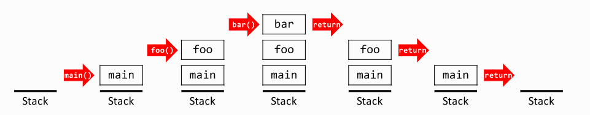

# Understanding the JavaScript Call Stack

## What is a 'call'?

 call stack is a data structure that uses the Last In, First Out (LIFO) principle to temporarily store and manage function invocation (call).

 ## How many 'calls' can happen at once?
 
It is single-threaded. Meaning it can only do one thing at a time.

 ## What does LIFO mean?

 Last In, First Out data structure.

## Draw an example of a call stack and the functions that would need to be invoked to generate that call stack.

void bar() {
}

void foo() {
  bar();
}

int main() {
  foo();
}

 ## What causes a Stack Overflow? 

 A stack overflow occurs when there is a recursive function (a function that calls itself) without an exit point. The browser (hosting environment) has a maximum stack call that it can accomodate before throwing a stack error.

## JavaScript error messages

 ## What is a 'reference error'?
 when you try to use a variable that is not yet declared you get this type os errors.
 
 ## What is a 'syntax error'?

 when you have something that cannot be parsed in terms of syntax, like when you try to parse an invalid object using JSON.parse.

 ## What is a 'range error'?

 thrown when trying to pass a value as an argument to a function that does not allow a range that includes the value.

 ## What is a 'tyep error'?

this types of errors show up when the types (number, string and so on) you are trying to use or access are incompatible, like accessing a property in an undefined type of variable.

## What is a breakpoint?

achieved by putting a debugger statement in your code in the line you want to break.

## What does the word 'debugger' do in your code?

 software tool that can help the software development process by identifying coding errors at various stages of the operating system or application development. Some debuggers will analyze a test run to see what lines of code were not executed.
