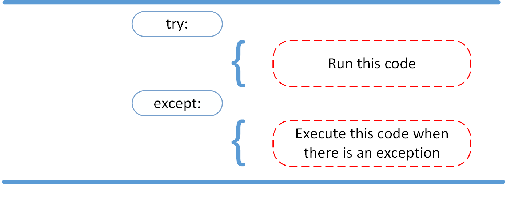

# Reading and Writing Files in Python

## What Is a File?

###  a file is a contiguous set of bytes used to store data. This data is organized in a specific format and can be anything as simple as a text file or as complicated as a program executable. In the end, these byte files are then translated into binary 1 and 0 for easier processing by the computer.

#### Three main parts:

- Header: metadata about the contents of the file (file name, size, type, and so on)
- Data: contents of the file as written by the creator or editor
- End of file (EOF): special character that indicates the end of the file

### File Paths

#### The file path is a string that represents the location of a file. It’s broken up into three major parts:

- Folder Path: the file folder location on the file system where subsequent folders are separated by a forward slash / (Unix) or backslash \ (Windows)

- File Name: the actual name of the file

- Extension: the end of the file path pre-pended with a period (.) used to indicate the file type

> /
│

├── path/  ← Referencing 
this parent folder
|   │

|   ├── to/  ← Current 
working directory (cwd)

|   │   └── cats.gif

|   │
|   └── dog_breeds.txt  ← Accessing this file

|
└── animals.csv

### Opening and Closing a File in Python

#### When you want to work with a file, the first thing to do is to open it. This is done by invoking the open() built-in function. open() has a single required argument that is the path to the file. open() has a single return, the file object:

>file = open('dog_breeds.txt')

#### close()
>reader = open('dog_breeds.txt')
try:
    # Further file processing goes here
finally:
    reader.close()

 #### The second way to close a file is to use the with statement:

> with open('dog_breeds.txt') as reader:
    # Further file processing goes here

### Tips and Tricks
 #### Now that you’ve mastered the basics of reading and writing files, here are some tips and tricks to help you grow your skills.

#### __file__
The __file__ attribute is a special attribute of modules, similar to __name__. It is:

>> “the pathname of the file from which the module was loaded, if it was loaded from a file.” (Source 

### Appending to a File

#### Sometimes, you may want to append to a file or start writing at the end of an already populated file. This is easily done by using the 'a' character for the mode argument:

> with open('dog_breeds.txt', 'a') as a_writer:
    a_writer.write('\nBeagle')

## Python Exceptions: An Introduction

 ### A Python program terminates as soon as it encounters an error. In Python, an error can be a syntax error or an exception.

 #### Exceptions versus Syntax Errors
- Syntax errors occur when the parser detects an incorrect statement. Observe the following example:

>>> print( 0 / 0 ))
  File "<stdin>", line 1
    print( 0 / 0 ))
                  ^
- SyntaxError: invalid syntax
The arrow indicates where the parser ran into the syntax error. 

### Raising an Exception

#### We can use raise to throw an exception if a condition occurs. The statement can be complemented with a custom exception.

- If you want to throw an error when a certain condition occurs using raise, you could go about it like this:

>>> x = 10
if x > 5:
    raise Exception('x should not exceed 5. The value of x was: {}'.format(x))

### The AssertionError Exception

#### instead of waiting for a program to crash midway, you can also start by making an assertion in Python. We assert that a certain condition is met. If this condition turns out to be True.

### The try and except Block: Handling Exceptions
 

 > try:
    linux_interaction()
except:
    pass

### The else Clause

> try:
    linux_interaction()
except AssertionError as error:
    print(error)
else:
    print('Executing the else clause.')

### Cleaning Up After Using finally

> try:
    linux_interaction()

except AssertionError as error:
    print(error)

else:
    
    try:
        with open('file.log') as file:
            read_data = file.read()

    
    except FileNotFoundError as fnf_error:
        print(fnf_error)
        
        >finally:
    print('Cleaning up, irrespective of any exceptions.')

