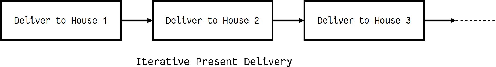
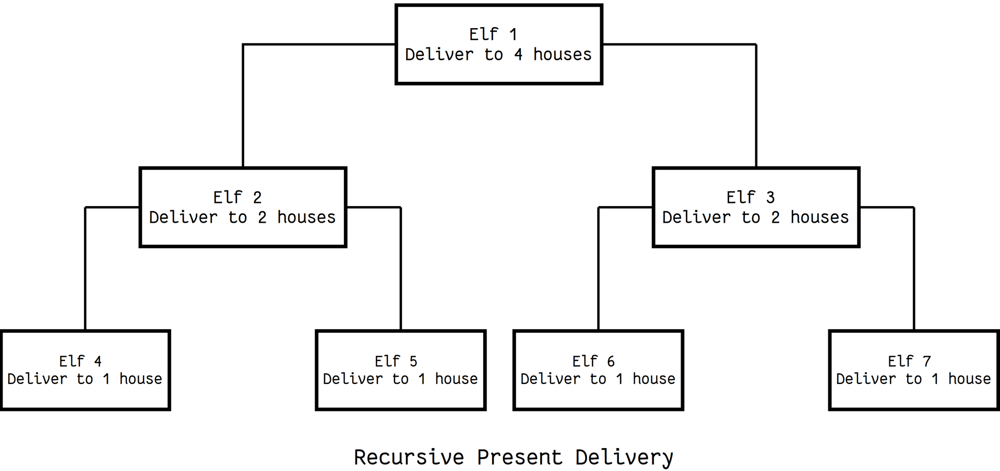

# Classes and Objects

## Objects are an encapsulation of variables and functions into a single entity. Objects get their variables and functions from classes. Classes are essentially a template to create your objects.

## Accessing Object Variables

>class MyClass:
    variable = "blah"

    def function(self):
        print("This is a message inside the class.")

 myobjectx = MyClass()

 myobjectx.variable

 ## Accessing Object Functions
 > class MyClass:
    variable = "blah"

    def function(self):
        print("This is a message inside the class.")

 myobjectx = MyClass()

 myobjectx.function() 

 ## init()
 #### The __init__() function, is a special function that is called when the class is being initiated. It's used for assigning values in a class.

 ## Thinking Recursively in Python

**This is the typical structure of a recursive algorithm. If the current problem represents a simple case, solve it. If not, divide it into subproblems and apply the same strategy to them**

## Recursive Functions in Python

**This means that the function will continue to call itself and repeat its behavior until some condition is met to return a result. All recursive functions share a common structure made up of two parts: base case and recursive case.**

> def factorial_recursive  (n):
    # Base case: 1! = 1
    if n == 1:
        return 1

    # Recursive case: n! = n * (n-1)!
    else:
        return n * factorial_recursive(n-1)

### Maintaining State

**When dealing with recursive functions, keep in mind that each recursive call has its own execution context, so to maintain state during recursion you have to either:**

- Thread the state through each recursive call so that the current state is part of the current call’s execution context

- Keep the state in global scope

### Recursive Data Structures in Python

**A data structure is recursive if it can be defined in terms of a smaller version of itself.**
- Starting with an empty list, you can generate any list by recursively applying the attach_head function, and thus the list data structure can be defined recursively as:

    >   +---- attach_head(element, smaller list)
>list = +
       +---- empty list

- Recursion can also be seen as self-referential function composition. We apply a function to an argument, then pass that result on as an argument to a second application of the same function, and so on. Repeatedly composing attach_head with itself is the same as attach_head calling itself repeatedly.

### Python Testing with pytest: Fixtures and Coverage

 #### When you're writing tests, you're rarely going to write just one or two. Rather, you're going to write an entire "test suite", with each test aiming to check a different path through your code. In many cases, this means you'll have a few tests with similar characteristics, something that pytest handles with "parametrized tests".

 #### In pytest, you define fixtures using a combination of the pytest.fixture decorator, along with a function definition. For example, say you have a file that returns a list of lines from a file, in which each line is reversed:

>def reverse_lines(f):
   return [one_line.rstrip()[::-1] + '\n'
           for one_line in f]

#### For example, let's assume you have a very strange function, only_odd_mul, which multiplies only odd numbers:

>def only_odd_mul(x, y):
   if x%2 and y%2:
       return x * y
   else:
       raise NoEvenNumbersHereException(f'{x} and/or {y}
 ↪not odd')

- Here's a test you can run on it:

> def test_odd_numbers():
   assert only_odd_mul(3, 5) == 15

**Sure enough, the test passed. It works great! The software is terrific!**