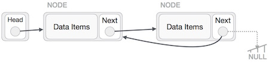

# data structures

## Data Structure and Algorithms - Linked List

### A linked list is a sequence of data structures, which are connected together via links.

- Link − Each link of a linked list can store a data called an element.

- Next − Each link of a linked list contains a link to the next link called Next.

- LinkedList − A Linked List contains the connection link to the first link called First.

### Linked List Representation

#### Linked list can be visualized as a chain of nodes, where every node points to the next node.

### important points to be considered.

- Linked List contains a link element called first.

- Each link carries a data field(s) and a link field called next.

- Each link is linked with its next link using its next link.

- Last link carries a link as null to mark the end of the list.

### Types of Linked List

##### Following are the various types of linked list.

- Simple Linked List − Item navigation is forward only.

- Doubly Linked List − Items can be navigated forward and backward.

- Circular Linked List − Last item contains link of the first element as next and the first element has a link to the last element as previous.

### Basic Operations

##### Following are the basic operations supported by a list.

- Insertion − Adds an element at the beginning of the list.

- Deletion − Deletes an element at the beginning of the list.
 
- Display − Displays the complete list.

- Search − Searches an element using the given key.

- Delete − Deletes an element using the given key.

### Insertion Operation

**Adding a new node in linked list is a more than one step activity. We shall learn this with diagrams here. First, create a node using the same structure and find the location where it has to be inserted.**

### Deletion Operation

**Deletion is also a more than one step process. We shall learn with pictorial representation. First, locate the target node to be removed, by using searching algorithms.**

> LeftNode.next −> TargetNode.next;

 

> TargetNode.next −> NULL;

### Reverse Operation

**This operation is a thorough one. We need to make the last node to be pointed by the head node and reverse the whole linked list.**

- First, we traverse to the end of the list. It should be pointing to NULL. Now, we shall make it point to its previous node 

- We have to make sure that the last node is not the last node. So we'll have some temp node, which looks like the head node pointing to the last node. Now, we shall make all left side nodes point to their previous nodes one by one.

- Except the node (first node) pointed by the head node, all nodes should point to their predecessor, making them their new successor. The first node will point to NULL.

- We'll make the head node point to the new first node by using the temp node.

