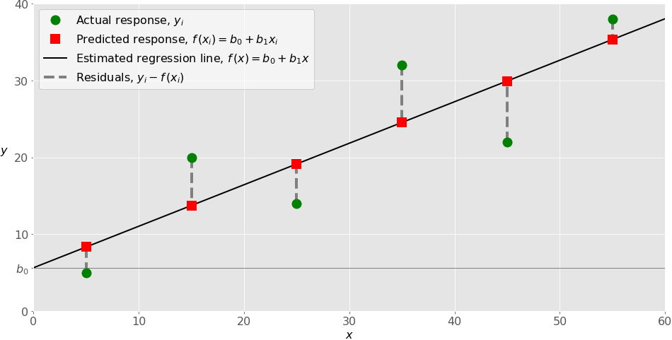

# Linear regression

**Scikit-learn is a powerful Python module for machine learning. It contains function for regression, classification, clustering, model selection and dimensionality reduction.**

### What Is Regression?

**searches for relationships among variables**
**function that maps some features or variables to others sufficiently well.**

- Example :you can observe several employees of some company and try to understand how their salaries depend on their features, such as experience, education level, role, city of employment, and so on.

### The dependent features are called the dependent variables, outputs, or responses. The independent features are called the independent variables, inputs, regressors, or predictors.

### When Do You Need Regression?

**you need regression to answer whether and how some phenomenon influences the other or how several variables are related.**

### Linear Regression
**Linear regression is probably one of the most important and widely used regression techniques. It’s among the simplest regression methods. One of its main advantages is the ease of interpreting results.**

#### Simple Linear Regression
**Simple or single-variate linear regression is the simplest case of linear regression, as it has a single independent variable, 𝐱 = 𝑥.**

#### Multiple Linear Regression

**Multiple or multivariate linear regression is a case of linear regression with two or more independent variables.**

### Underfitting and Overfitting

**There’s no straightforward rule for doing this. It depends on the case. You should, however, be aware of two problems that might follow the choice of the degree: underfitting and overfitting.**

- Underfitting occurs when a model can’t accurately capture the dependencies among data, usually as a consequence of its own simplicity.

- Overfitting happens when a model learns both data dependencies and random fluctuations. In other words, a model learns the existing data too well.

### Python Packages for Linear Regression

- **NumPy is a fundamental Python scientific package that allows many high-performance operations on single-dimensional and multidimensional arrays. It also offers many mathematical routines. Of course, it’s open-source.**

- **The package scikit-learn is a widely used Python library for machine learning, built on top of NumPy and some other packages. It provides the means for preprocessing data, reducing dimensionality, implementing regression, classifying, clustering, and more. Like NumPy, scikit-learn is also open-source.**

#### steps when you’re implementing linear regression:

- Import the packages and classes that you need.

>import numpy as np
from sklearn.linear_model import LinearRegression

- Provide data to work with, and eventually do appropriate transformations.

>x = np.array([5, 15, 25, 35, 45, 55]).reshape((-1, 1))
y = np.array([5, 20, 14, 32, 22, 38])

- Create a regression model and fit it with existing data.

> model = LinearRegression()

#### several optional parameters to LinearRegression:

- fit_intercept is a Boolean that, if True, decides to calculate the intercept 𝑏₀ or, if False, considers it equal to zero. It defaults to True.

- normalize is a Boolean that, if True, decides to normalize the input variables. It defaults to False, in which case it doesn’t normalize the input variables.

- copy_X is a Boolean that decides whether to copy (True) or overwrite the input variables (False). It’s True by default.

- n_jobs is either an integer or None. It represents the number of jobs used in parallel computation. It defaults to None, which usually means one job. -1 means to use all available processors.

- 4- Check the results of model fitting to know whether the model is satisfactory.

 >>> r_sq = model.score(x, y)
>>> print(f"coefficient of determination: {r_sq}")

- Apply the model for predictions.

### Conclusion

#### Linear regression is implemented with the following:

- scikit-learn if you don’t need detailed results and want to use the approach consistent with other regression techniques.

- statsmodels if you need the advanced statistical parameters of a model.

####  performing linear regression in Python:

- Import the packages and classes you need

- Provide data to work with and eventually do appropriate transformations

- Create a regression model and fit it with existing data

- Check the results of model fitting to know whether the model is satisfactory

- Apply the model for predictions
