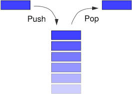

# Stacks and Queues

- **A stack is a limited access data structure - elements can be added and removed from the stack only at the top.**

- only two operations are allowed: push the item into the stack, and pop the item out of the stack. 
-
- push adds an item to the top of the stack, pop removes the item from the top

- A stack is a linear data structure that follows the principle of Last In First Out (LIFO). This means the last element inserted inside the stack is removed first.

### LIFO Principle of Stack

**In programming terms, putting an item on top of the stack is called push and removing an item is called pop.**

#### Basic Operations of Stack

- Push: Add an element to the top of a stack

- Pop: Remove an element from the top of a stack

- IsEmpty: Check if the stack is empty

- IsFull: Check if the stack is full

- Peek: Get the value of the top element without removing it

#### Stack Time Complexity

**the push and pop operations take constant time, i.e. O(1).**

#### Applications of Stack Data Structure

- To reverse a word 

- In compilers 

- In browsers - The back button in a browser saves all the URLs you have visited previously in a stack

### Auxiliary Stack Operations:

- int top(): This operation will return the last inserted element that is at the top without removing it.

- int size(): This operation will return the size of the stack i.e. the total number of elements present in the stack.

- int isEmpty(): This operation indicates whether the stack is empty or not.

- int isFull(): This operation indicates whether the stack is full or not.

#### Types of Stacks:

- **Register Stack: This type of stack is also a memory element present in the memory unit and can handle a small amount of data only.**

- **Memory Stack: This type of stack can handle a large amount of memory data**

#### Application of Stack Data Structure:

- Stack is used for evaluating expression with operands and operations.

- Matching tags in HTML and XML

- Undo function in any text editor.

- Infix to Postfix conversion.

- Stacks are used for backtracking and parenthesis matching.
## Queue:

-  In the queue only two operations are allowed enqueue and dequeue.

- Enqueue means to insert an item into the back of the queue, dequeue means removing the front item. 

- difference between stacks and queues is in removing. In a stack we remove the item the most recently added; in a queue, we remove the item the least recently added.

- Queue is used when things don’t have to be processed immediately, but have to be processed in First In First Out order. 

### Useful Applications of Queue

- When a resource is shared among multiple consumers. Examples include CPU scheduling, Disk Scheduling. 

- When data is transferred asynchronously (data not necessarily received at the same rate as sent) between two processes. Examples include IO Buffers, pipes, etc. 

#### Applications of Queue in Operating systems:

- Semaphores

- FCFS ( first come first serve) scheduling, example: FIFO queue

- Spooling in printers

- Buffer for devices like keyboard

### Applications of Queue in Networks:

- Queues in routers/ switches 

- Mail Queues

- Variations: ( Deque, Priority Queue, Doubly Ended Priority Queue )

