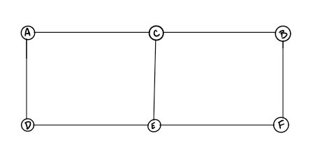
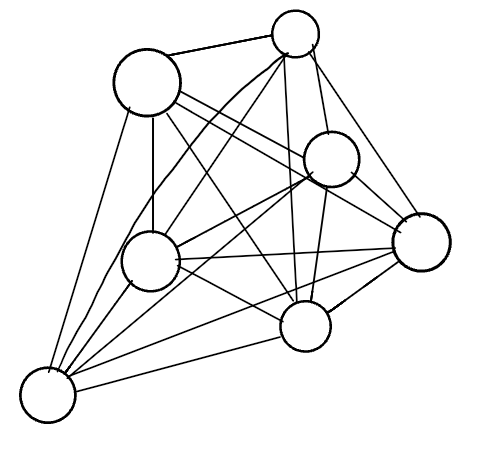
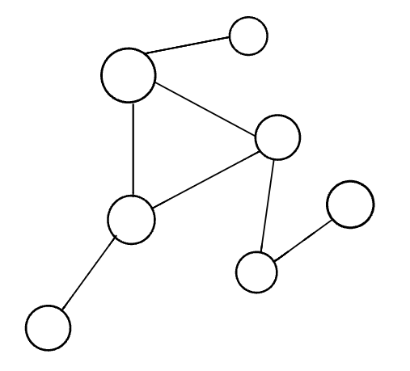

# Graphs

## A graph is a non-linear data structure that can be looked at as a collection of vertices (or nodes) potentially connected by line segments named edges.

### some common terminology used when working with Graphs:

- Vertex - A vertex, also called a “node”, is a data object that can have zero or more adjacent vertices.

- Edge - An edge is a connection between two nodes.

- Neighbor - The neighbors of a node are its adjacent nodes, i.e., are connected via an edge.

- Degree - The degree of a vertex is the number of edges connected to that vertex.

## Directed vs Undirected

### Undirected Graphs

**An Undirected Graph is a graph where each edge is undirected or bi-directional. This means that the undirected graph does not move in any direction.**

**Vertices/Nodes = {a,b,c,d,e,f}**

**Edges = {(a,c),(a,d),(b,c),(b,f),(c,e),(d,e),(e,f)}**

## Directed Graphs (Digraph)

**A Directed Graph also called a Digraph is a graph where every edge is directed.**

**Unlike an undirected graph, a Digraph has direction. Each node is directed at another node with a specific requirement of what node should be referenced next.**

**Vertices = {a,b,c,d,e,f}**

**Edges = {(a,c),(b,c),(b,f),(c,e),(d,a),(d,e)(e,c)(e,f)}**

## Complete vs Connected vs Disconnected

### Complete Graphs

**A complete graph is when all nodes are connected to all other nodes.**

### Connected

**A connected graph is graph that has all of vertices/nodes have at least one edge.**

**Note : In the visual above, this looks a lot more than what you are used to seeing. If you look closely at the different vertices of the graph, you will see that each node is connected to at least one other node or vertices. A Tree is a form of a connected graph. We will talk more about that in a bit.**

### Disconnected

**A disconnected graph is a graph where some vertices may not have edges.**

## Acyclic vs Cyclic

**In addition to undirected and directed graphs, we also have acyclic and cyclic graphs.**

### Cyclic Graphs

**A Cyclic graph is a graph that has cycles.**

- A cycle is defined as a path of a positive length that starts and ends at the same vertex.

### Graph Representation

1- Adjacency Matrix
2- Adjacency List

### Adjacency Matrix

**An Adjacency matrix is represented through a 2-dimensional array. If there are n vertices, then we are looking at an n x n Boolean matrix**

**Each Row and column represents each vertex of the data structure. The elements of both the column and the row must add up to 1 if there is an edge that connects the two, or zero if there isn’t a connection.**

### Adjacency List

- An adjacency list is a collection of linked lists or array that lists all of the other vertices that are connected.

- Adjacency lists make it easy to view if one vertices connects to another.

- We can visually see that we are working with a collection of some sort. The visual is depicting a Linked List, but you could easily make it an array of arrays if you’d like.

- Each index or node (depending on the data structure you choose to represent the adjacency list) will be a vertex within the graph.

- Every time you add an edge, you will find the appropriate vertices in the data structure and add it to the appropriate location.

## Real World Uses of Graphs

1- GPS and Mapping

2- Driving Directions

3-Social Networks

4-Airline Traffic

5-Netflix uses graphs for suggestions of products