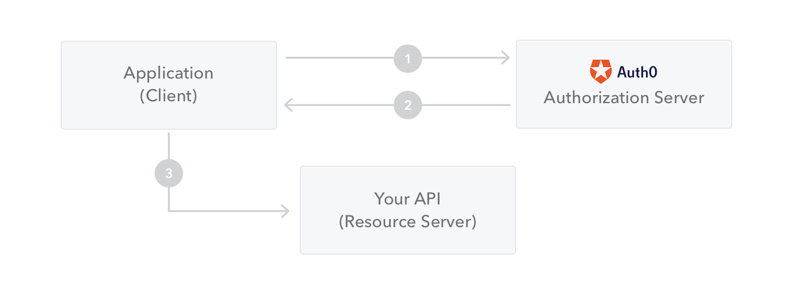

# JSON Web Token

## JSON Web Token (JWT) is an open standard (RFC 7519) that defines a compact and self-contained way for securely transmitting information between parties as a JSON object. 

- This information can be verified and trusted because it is digitally signed.

- JWTs can be signed using a secret (with the HMAC algorithm) or a public/private key pair using RSA or ECDSA.

## When should you use JSON Web Tokens?

### Authorization:

 **This is the most common scenario for using JWT. Once the user is logged in, each subsequent request will include the JWT, allowing the user to access routes, services, and resources that are permitted with that token. Single Sign On is a feature that widely uses JWT nowadays, because of its small overhead and its ability to be easily used across different domains.**

### Information Exchange: 

**JSON Web Tokens are a good way of securely transmitting information between parties. Because JWTs can be signed—for example, using public/private key pairs—you can be sure the senders are who they say they are. Additionally, as the signature is calculated using the header and the payload, you can also verify that the content hasn't been tampered with.**

### What is the JSON Web Token structure?

- Header
- Payload
- Signature

**Therefore, a JWT typically looks like the following**
>>
 xxxxx.yyyyy.zzzzz

### Header

**The header typically consists of two parts: the type of the token, which is JWT, and the signing algorithm being used, such as HMAC SHA256 or RSA.**

>>
 {
  "alg": "HS256",
  "typ": "JWT"
 }

### Payload

**The second part of the token is the payload, which contains the claims. Claims are statements about an entity (typically, the user) and additional data. There are three types of claims: registered, public, and private claims.**

- #### Registered claims: 

**These are a set of predefined claims which are not mandatory but recommended, to provide a set of useful, interoperable claims. Some of them are: iss (issuer), exp (expiration time), sub (subject), aud (audience), and others.**

- ####  Public claims: These can be defined at will by those using JWTs. But to avoid collisions they should be defined in the IANA JSON Web Token Registry or be defined as a URI that contains a collision resistant namespace.

- #### Private claims: These are the custom claims created to share information between parties that agree on using them and are neither registered or public claims.

>>
    {
  "sub": "1234567890",
  "name": "John Doe",
  "admin": true
  }

### Signature

#### To create the signature part you have to take the encoded header, the encoded payload, a secret, the algorithm specified in the header, and sign that.

>>
    HMACSHA256(
  base64UrlEncode(header) + "." +
  base64UrlEncode(payload),
  secret)

### Putting all together:

**The output is three Base64-URL strings separated by dots that can be easily passed in HTML and HTTP environments, while being more compact when compared to XML-based standards such as SAML.**

### How do JSON Web Tokens work?

**In authentication, when the user successfully logs in using their credentials, a JSON Web Token will be returned. Since tokens are credentials, great care must be taken to prevent security issues. In general, you should not keep tokens longer than required.**

**Note that if you send JWT tokens through HTTP headers, you should try to prevent them from getting too big. Some servers don't accept more than 8 KB in headers. If you are trying to embed too much information in a JWT token, like by including all the user's permissions, you may need an alternative solution, like Auth0 Fine-Grained Authorization.**

1- The application or client requests authorization to the authorization server. This is performed through one of the different authorization flows. For example, a typical OpenID 

2-Connect compliant web application will go through the /oauth/authorize endpoint using the authorization code flow.
When the authorization is granted, the authorization server returns an access token to the application.

3-The application uses the access token to access a protected resource (like an API).

### Why should we use JSON Web Tokens?

1- As JSON is less verbose than XML, when it is encoded its size is also smaller, making JWT more compact than SAML. 

2- Security-wise, SWT can only be symmetrically signed by a shared secret using the HMAC algorithm. However, JWT and SAML tokens can use a public/private key pair in the form of a X.509 certificate for signing.

3- JSON parsers are common in most programming languages because they map directly to objects. Conversely, XML doesn't have a natural document-to-object mapping. 

